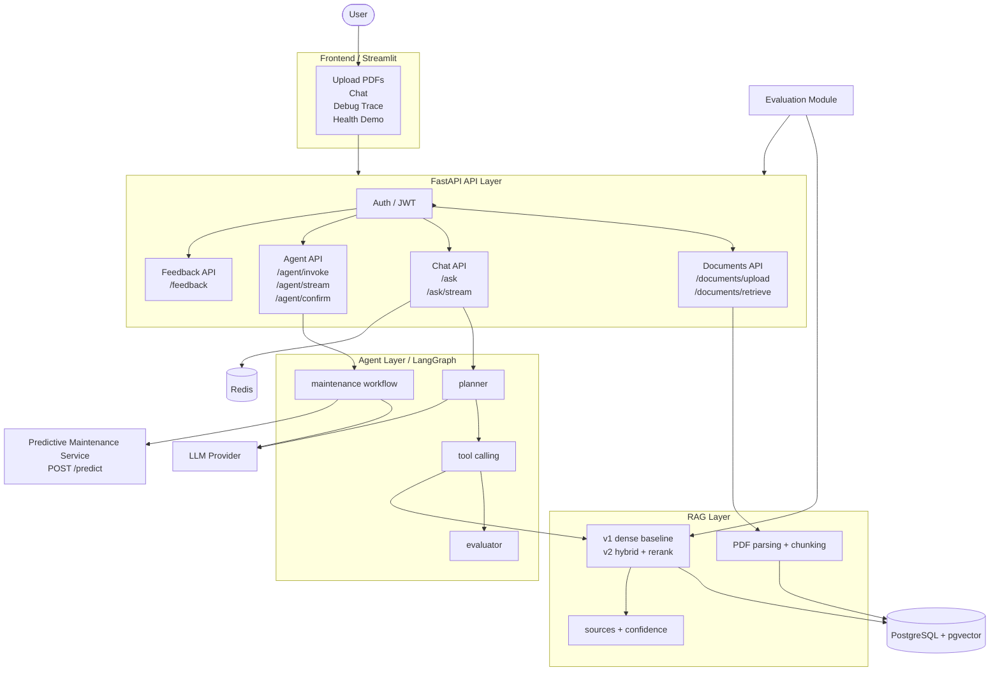

# Industrial Maintenance Agent Platform

> Chinese README: [README.md](README.md)

This repository is a local AI application system for industrial maintenance scenarios. It combines PDF manual retrieval, a LangGraph Agent workflow, JWT-protected FastAPI APIs, PostgreSQL + pgvector persistence, Redis rate limiting, pytest coverage, and Docker Compose deployment.

The project is positioned as an engineering demo for AI application development, LLM application development, and RAG & Agent internship applications. It is not described as a production decision system.

## Value In 30 Seconds

| Area | What this project shows |
| --- | --- |
| RAG | PDF parsing, chunking, embeddings, pgvector retrieval, sources, confidence, and debug trace |
| Agent | LangGraph state graphs, tool calling, evaluator loop, streaming events, and human confirmation |
| Backend | FastAPI, Pydantic, JWT auth, SQLAlchemy, Alembic, PostgreSQL, Redis, Docker Compose |
| Industrial scenario | Maintenance manual retrieval plus predictive maintenance tool orchestration |
| Quality work | pytest, smoke scripts, retrieval evaluation, optional RAGAS evaluation |

## Core Architecture


```mermaid
flowchart TB
    user(["User"])

    subgraph frontend["Frontend / Streamlit"]
        ui["Upload PDFs<br/>Chat<br/>Debug Trace<br/>Health Demo"]
    end

    subgraph api["FastAPI API Layer"]
        auth["Auth / JWT"]
        docs_api["Documents API<br/>/documents/upload<br/>/documents/retrieve"]
        chat_api["Chat API<br/>/ask<br/>/ask/stream"]
        agent_api["Agent API<br/>/agent/invoke<br/>/agent/stream<br/>/agent/confirm"]
        feedback_api["Feedback API<br/>/feedback"]
    end

    subgraph agent["Agent Layer / LangGraph"]
        planner["planner"]
        tools["tool calling"]
        evaluator["evaluator"]
        maintenance["maintenance workflow"]
    end

    subgraph rag["RAG Layer"]
        parser["PDF parsing + chunking"]
        retrieval["v1 dense baseline<br/>v2 hybrid + rerank"]
        evidence["sources + confidence"]
    end

    pg[("PostgreSQL + pgvector")]
    redis[("Redis")]
    predictive["Predictive Maintenance Service<br/>POST /predict"]
    llm["LLM Provider"]
    evals["Evaluation Module"]

    user --> ui --> api --> auth
    auth --> docs_api
    auth --> chat_api
    auth --> agent_api
    auth --> feedback_api
    docs_api --> parser --> pg
    chat_api --> planner --> tools --> evaluator
    agent_api --> maintenance
    tools --> retrieval --> pg
    retrieval --> evidence
    planner --> llm
    maintenance --> llm
    maintenance --> predictive
    chat_api --> redis
    evals --> api
    evals --> retrieval
```

## Main APIs

Most business APIs require `Authorization: Bearer <access_token>`.

| method | path | purpose |
| --- | --- | --- |
| `POST` | `/auth/register` | Create a local user |
| `POST` | `/auth/login` | Return JWT token |
| `POST` | `/documents/upload` | Upload a PDF and build a knowledge base |
| `DELETE` | `/documents/{document_id}` | Delete the current user's document, chunks, and embeddings |
| `POST` | `/ask` or `/chat` | RAG + LangGraph Agent chat |
| `POST` | `/ask/stream` | SSE streaming chat endpoint |
| `POST` | `/agent/invoke` | Industrial maintenance Agent invocation |
| `POST` | `/agent/stream` | Node-level SSE events for the maintenance Agent |
| `POST` | `/agent/confirm` | Confirm or decline high-risk maintenance actions |
| `POST` | `/feedback` | Store user feedback |
| `POST` | predictive service `/predict` | Single predictive maintenance inference |

## Local Start

```bash
git clone https://github.com/ShihangPENg-afk/rag-agentic-system.git
cd rag-agentic-system
make env-init
# edit .env: DASHSCOPE_API_KEY, POSTGRES_USER, POSTGRES_PASSWORD, JWT_SECRET_KEY
make docker-up
```

Open `http://127.0.0.1:8000/docs`.

For local FastAPI development:

```bash
make install
make env-init
docker compose up postgres redis -d
make run
```

For Streamlit:

```bash
source .venv/bin/activate
pip install -r ui/requirements-ui.txt
export API_BASE_URL=http://127.0.0.1:8000
export HEALTH_API_URL=http://127.0.0.1:8010
make ui
```

## Retrieval Versions

| Version | Meaning |
| --- | --- |
| v1 FAISS baseline | Earlier in-process vector fallback, kept for compatibility |
| v1 pgvector baseline | Current dense retrieval baseline backed by PostgreSQL + pgvector |
| v2 hybrid | pgvector dense retrieval plus BM25 keyword retrieval and candidate fusion |
| v2 hybrid + rerank | Optional second-stage reranking through `RERANK_PROVIDER` |

No fixed performance improvement percentage is claimed. Run `evals/evaluate_retrieval.py` on the same document set before reporting numbers.

## RAG And LoRA Boundary

The main system is RAG + Agent. LoRA experiments live in `llm-finetune-for-manufacturing` and are not part of the default runtime. RAG handles dynamic knowledge and citations; LoRA would be useful later for response format and domain expression after controlled evaluation.

## Verification

```bash
make test
make smoke
EVAL_USER_ID=<user_id> python3 evals/evaluate_retrieval.py --top-k 5
```

See [README.md](README.md) for the full Chinese documentation.

## License

[MIT License](LICENSE)
