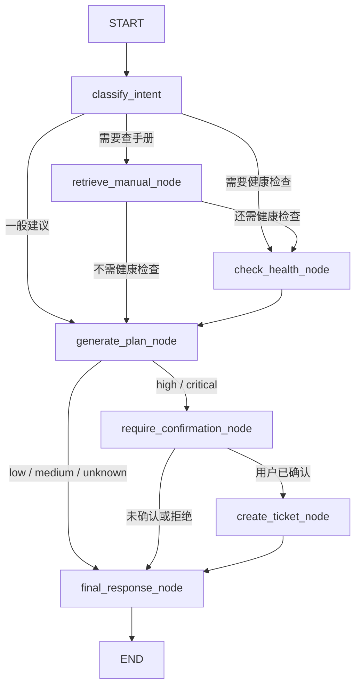

# Maintenance Agent Workflow

本文档用于解释当前项目中的 `maintenance_agent` 设计。写法偏面试复述，重点说明为什么这样拆 LangGraph 的 state、node、edge 和 tool，而不是把所有逻辑塞进一个长函数里。

## 1. 业务目标

`maintenance_agent` 面向工业设备运维场景，目标是把“查手册、看设备状态、生成维护建议、必要时创建工单”串成一条可控流程。

用户可以问几类问题：

- 设备故障原因：例如“设备报警后可能是什么原因？”
- 手册内容查询：例如“维护手册里报警后先检查哪些部件？”
- 风险预测：例如“当前温度和振动偏高，风险大吗？”
- 维护建议：例如“请给出下一步检查建议。”
- 零件检查：例如“应该先检查润滑、冷却还是连接状态？”

设计上有两个核心原则：

- 需要依据资料时，优先走 RAG 检索，返回 `sources`，避免没有依据地回答。
- 涉及高风险动作时，不让 Agent 直接创建工单，而是先进入 human-in-the-loop 确认。

入口接口：

- `POST /agent/invoke`：普通同步调用。
- `POST /agent/stream`：SSE 流式返回执行过程。
- `POST /agent/confirm`：高风险场景下确认或拒绝创建工单。

## 2. State 设计

State 是整条 Agent 工作流共享的上下文。每个节点只读写自己关心的字段，这样节点之间通过明确字段传递信息。

当前 `MaintenanceAgentState` 主要分为几类：

| 类别 | 字段 | 作用 |
| --- | --- | --- |
| 请求上下文 | `user_input`, `machine_id`, `session_id`, `user_id`, `messages` | 保存用户问题、设备 ID、会话和用户身份 |
| RAG 配置 | `knowledge_base_id`, `document_id`, `collection_id`, `retriever_version`, `top_k`, `use_rerank` | 控制检索范围、v1/v2 检索版本、召回数量和是否 rerank |
| 路由判断 | `intent`, `retrieve_query`, `need_retrieval`, `need_prediction` | `classify_intent` 节点输出，用于决定后续走哪条边 |
| 检索结果 | `retrieved_chunks`, `sources`, `confidence` | 保存 RAG 召回片段、来源 metadata 和置信度 |
| 健康预测 | `sensor_data`, `health_result`, `risk_level`, `risk_score` | 保存传感器数据和设备健康检查结果 |
| 维护建议 | `maintenance_plan`, `draft_answer`, `recommended_action` | 保存生成的维护步骤和建议动作 |
| Human-in-the-loop | `confirmation_required`, `confirmation_message`, `ticket_confirmed`, `from_confirm_endpoint`, `decision` | 控制高风险时是否需要人工确认，以及确认结果 |
| 工单 | `ticket`, `confirm_create_ticket` | 保存模拟工单结果；当前不会真实调用外部工单系统 |
| 可观测性 | `trace_id`, `trace_recorder`, `tools_used`, `errors`, `debug` | 记录工具调用、错误、trace 和调试信息 |
| 最终输出 | `final_answer` | 返回给接口调用方的最终回答 |

面试时可以这样解释：

> State 就像 Agent 的一张流程单。每个节点在流程单上补充自己负责的信息，比如意图、检索结果、风险等级、工单状态。这样工作流是可追踪的，也方便测试单个节点。

## 3. Node 设计

当前 LangGraph 状态图包含 7 个节点：

| Node | 主要职责 | 读 State | 写 State |
| --- | --- | --- | --- |
| `classify_intent` | 判断用户意图，决定是否需要查手册或查设备健康 | `user_input`, `machine_id`, `sensor_data`, `user_id`, `session_id` | `intent`, `need_retrieval`, `need_prediction`, `history`, `tools_used` |
| `retrieve_manual_node` | 调用 RAG 检索维护手册 | `retrieve_query`, RAG 配置字段 | `retrieved_chunks`, `sources`, `confidence`, `errors`, `tools_used` |
| `check_health_node` | 调用设备健康检查服务或 mock 预测 | `machine_id`, `sensor_data` | `health_result`, `risk_level`, `risk_score`, `tools_used` |
| `generate_plan_node` | 根据手册片段和风险结果生成维护建议 | `user_input`, `machine_id`, `retrieved_chunks`, `health_result`, `history` | `maintenance_plan`, `draft_answer`, `recommended_action`, `tools_used` |
| `require_confirmation_node` | 高风险时要求人工确认 | `risk_level`, `recommended_action` | `confirmation_required`, `confirmation_message`, `decision`, `tools_used` |
| `create_ticket_node` | 用户确认后创建模拟工单 | `machine_id`, `user_input`, `risk_level`, `maintenance_plan` | `ticket`, `decision`, `tools_used` |
| `final_response_node` | 整理最终响应 | `draft_answer`, `ticket`, `sources`, `confidence`, `decision` | `final_answer`, `risk_level`, `sources`, `debug`, `tools_used` |

拆成这些节点的原因是：

- 意图判断、检索、预测、计划生成、确认、工单创建是不同职责。
- 每个节点都比较短，方便单测和排查。
- 高风险确认可以作为独立节点插入，而不是藏在回答生成逻辑里。

## 4. Tool 设计

工具封装在 `app/agents/maintenance_agent/tools.py`，节点不直接写复杂业务逻辑，而是调用 tool。

### `retrieve_manual`

输入：

- `query`
- `knowledge_base_id`
- `user_id`
- `document_id`
- `collection_id`
- `retriever_version`
- `top_k`
- `use_rerank`

输出：

- `chunks`
- `sources`
- `confidence`
- `error`
- `retriever_version`

作用：

- 调用当前 RAG 检索能力。
- `retriever_version="v2"` 时优先使用 hybrid retriever。
- v2 无结果时保留 pgvector fallback；需要时也保留旧 FAISS fallback。
- 输出保留 `source_metadata`，便于回答中展示来源。

### `check_machine_health`

输入：

- `machine_id`
- `sensor_data`
- `provider`

输出：

- `machine_id`
- `provider`
- `prediction`
- `risk_level`
- `risk_score`
- `recommendation`
- `probabilities`

作用：

- 默认使用 mock 预测，方便本地测试。
- 如果配置 `MAINTENANCE_HEALTH_PROVIDER` 且有有效传感器数据，可以尝试调用已有 predictive-maintenance-mini 能力。
- 当前 mock 逻辑会根据温度、振动等简单阈值返回 `low`、`medium`、`high`。

### `generate_maintenance_plan`

输入：

- `user_input`
- `machine_id`
- `retrieved_chunks`
- `health_result`
- `history`

输出：

- `machine_id`
- `risk_level`
- `plan`
- `answer`
- `query`

作用：

- 当前先用 deterministic/mock 逻辑生成维护建议，不依赖真实 LLM。
- 结合手册召回片段、风险等级和历史会话。
- 如果没有手册片段，会提醒执行具体操作前由工程师确认。

### `create_ticket_mock`

输入：

- `machine_id`
- `user_input`
- `risk_level`
- `maintenance_plan`
- `user_id`
- `session_id`

输出：

- `ticket_id`
- `status`
- `machine_id`
- `risk_level`
- `title`
- `description`
- `maintenance_plan`
- `created_at`
- `external_call`

作用：

- 只创建本地模拟工单。
- `external_call=false`，不调用真实外部系统。
- 只在用户通过 `/agent/confirm` 确认后调用。

### `list_history`

输入：

- `user_id`
- `session_id`
- `limit`

输出：

- `sessions`
- `messages`
- `maintenance_records`
- `error`

作用：

- 读取当前用户历史会话或指定 session 的消息。
- 当前维护记录先预留为空数组，后续可以接入真实 CMMS/EAM 系统。

## 5. Conditional Edge 设计

状态图入口是 `START -> classify_intent`。之后通过 conditional edge 决定执行路径。

当前主要条件如下：

| 起点 | 条件 | 终点 |
| --- | --- | --- |
| `classify_intent` | `need_retrieval == true` | `retrieve_manual_node` |
| `classify_intent` | 不查手册但 `need_prediction == true` | `check_health_node` |
| `classify_intent` | 既不查手册也不查健康 | `generate_plan_node` |
| `retrieve_manual_node` | `need_prediction == true` | `check_health_node` |
| `retrieve_manual_node` | 不需要健康检查 | `generate_plan_node` |
| `check_health_node` | 固定进入计划生成 | `generate_plan_node` |
| `generate_plan_node` | `risk_level` 是 `high` 或 `critical` | `require_confirmation_node` |
| `generate_plan_node` | 其他风险等级 | `final_response_node` |
| `require_confirmation_node` | 来自 `/agent/confirm` 且用户确认 | `create_ticket_node` |
| `require_confirmation_node` | 未确认或拒绝 | `final_response_node` |
| `create_ticket_node` | 工单创建后 | `final_response_node` |
| `final_response_node` | 流程结束 | `END` |

简化流程图：



## 6. Human-in-the-loop 逻辑

高风险运维动作不能让 Agent 自动执行，所以当前设计把确认拆成两步：

第一步：调用 `POST /agent/invoke`。

- 如果 `risk_level == high` 或 `critical`，进入 `require_confirmation_node`。
- 返回 `confirmation_required=true`。
- 返回 `recommended_action`。
- 返回 `decision="pending"`。
- 返回 `trace_id`。
- 不调用 `create_ticket_mock`，`ticket` 为空。

第二步：用户调用 `POST /agent/confirm`。

- `decision="confirmed"`：才调用 `create_ticket_mock`，生成模拟工单。
- `decision="declined"`：记录 `decision=declined`，不创建工单。

这样做的好处是：

- 高风险动作有明确的人类确认点。
- 接口层可以把确认动作做成按钮、审批流或二次弹窗。
- trace 中能看到高风险判断和用户决策，方便审计。

当前待确认记录保存在服务内存中，适合本地 demo 和测试。生产环境可以替换成数据库表，例如 `agent_pending_actions`，避免进程重启后丢失待确认状态。

## 7. Streaming 设计

`POST /agent/stream` 使用 FastAPI `StreamingResponse`，返回 SSE 格式事件。它的目标不是替代 `/agent/invoke`，而是让调用方可以看到 Agent 正在执行哪一步。

至少输出这些事件：

- `intent_classified`：意图识别完成，返回 `intent`、`need_retrieval`、`need_prediction`。
- `tool_started`：某个节点或工具开始执行。
- `tool_finished`：某个节点或工具执行完成。
- `risk_checked`：设备风险检查完成，返回 `risk_level`、`risk_score`。
- `final_answer`：最终回答完成，返回 `final_answer`、`sources`、`tools_used`、`trace_id` 等。

curl 测试示例：

```bash
curl -N -X POST "http://127.0.0.1:8000/agent/stream" \
  -H "Content-Type: application/json" \
  -d '{
    "user_input": "请检查设备当前健康状态并给维护建议",
    "machine_id": "MACHINE-001",
    "sensor_data": {"temperature": 82, "vibration": 0.3}
  }'
```

面试时可以这样解释：

> stream 接口把 Agent 的中间过程暴露出来。用户不用等到最后才知道发生了什么，前端也可以实时展示“正在查手册”“正在检查风险”“需要人工确认”等状态。

## 8. Trace 设计

每次 `/agent/invoke` 都会生成一个 `trace_id`。节点执行时通过 `AgentTraceRecorder` 写结构化日志，logger 名称是 `agent_traces`。

每条 trace 记录包含：

- `trace_id`
- `node_name`
- `tool_name`
- `input_summary`
- `output_summary`
- `latency_ms`
- `error`

trace 的作用：

- 排查路由：为什么这个问题走了 RAG，或者为什么直接走健康检查。
- 排查耗时：哪个节点最慢，比如检索慢还是预测慢。
- 排查错误：某个 tool 出错时能看到对应节点和简化输入。
- 方便审计：高风险场景下能追踪到确认节点和用户决策。

当前实现是结构化日志，没有接 LangSmith 或 Langfuse。后续如果要接入，可以把 `AgentTraceRecorder.record()` 当成统一出口，把日志事件同步写到 LangSmith、Langfuse 或数据库。

## 9. 面试时如何解释 LangGraph 概念

### State

State 是整个 Agent 流程共享的数据结构。

可以这样说：

> 我把 State 设计成一张运维流程单，里面有用户问题、设备 ID、RAG 配置、检索结果、风险等级、工单状态和 trace 信息。每个节点只更新自己负责的字段，所以流程可测试、可追踪，也方便扩展。

### Node

Node 是一个可执行步骤。

可以这样说：

> 每个 node 对应一个业务动作，比如分类意图、检索手册、检查设备健康、生成维护计划、请求人工确认、创建工单。这样比一个大函数更清楚，因为每一步的输入输出都能单独看，也能单独 mock 测试。

### Edge

Edge 是节点之间的固定连接。

可以这样说：

> 普通 edge 表示稳定的执行顺序，例如健康检查后一定进入维护计划生成，创建工单后一定进入最终回答。它表达的是业务流程里的固定步骤。

### Conditional Edge

Conditional edge 是根据 State 动态选择下一步。

可以这样说：

> conditional edge 是这套 Agent 的关键。它会看 State 里的 `need_retrieval`、`need_prediction`、`risk_level` 和用户确认结果，决定下一步是查手册、查健康、要求人工确认，还是直接返回答案。

### 为什么适合这个项目

可以这样总结：

> 工业运维 Agent 不是单轮问答，它有明确流程和风险控制。LangGraph 适合把它拆成状态、节点和条件边：RAG 提供依据，预测服务提供风险判断，human-in-the-loop 控制高风险动作，trace 和 stream 让执行过程可观察。这样既能跑 demo，也能逐步替换成真实 LLM、真实预测服务和真实工单系统。
