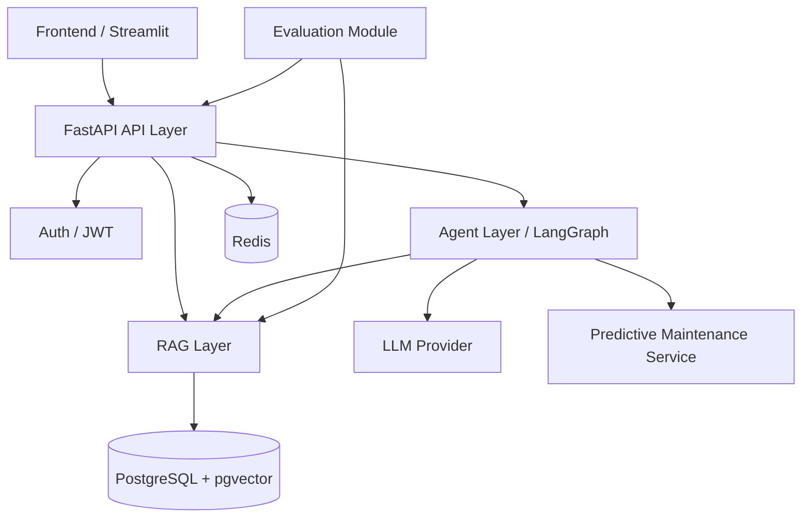

# Industrial Maintenance Agent Platform Architecture

本文档描述当前仓库的实际结构。主路径是 **FastAPI + RAG + LangGraph Agent + PostgreSQL + pgvector + Redis**，并通过 HTTP 调用独立的 `predictive-maintenance-mini` 预测服务。

## 1. 分层视图



| 层 | 当前职责 |
| --- | --- |
| Frontend / Streamlit | 登录、上传 PDF、问答、查看 Debug Trace、调用健康预测演示页 |
| FastAPI API Layer | 认证、文档管理、问答、Agent 调用、反馈、健康检查 |
| Auth / JWT | `/auth/register` 与 `/auth/login` 创建用户并签发 Bearer token |
| RAG Layer | PDF 解析、切块、embedding、pgvector dense retrieval、BM25 hybrid retrieval、rerank 扩展点 |
| Agent Layer / LangGraph | 通用问答 Agent 与工业运维 Agent 两套状态图 |
| PostgreSQL + pgvector | 用户、文档、chunks、embeddings、chat sessions、messages、QA logs |
| Redis | chat 接口用户级限流；Redis 不可用时当前实现会放行并记录 warning |
| Predictive Maintenance Service | sibling repo `predictive-maintenance-mini`，通过 `POST /predict` 提供传感器风险判断 |
| Evaluation Module | pytest、smoke test、retrieval evaluation、可选 RAGAS |

## 2. FastAPI 入口

FastAPI app 在 `app/main.py` 创建，路由聚合在 `app/api/routes.py`。

主要路由文件：

- `app/api/routes_auth.py`：JWT 注册登录
- `app/api/upload.py`：`/documents/upload` 与兼容旧路径 `/upload_pdf/`
- `app/api/routes_documents.py`：文档列表、删除、替换、检索、QA logs
- `app/api/routes_chat.py`：`/ask`、`/chat`、`/ask/stream`、`/ask_rag/`
- `app/api/routes_agent.py`：`/agent/invoke`、`/agent/stream`、`/agent/confirm`
- `app/api/routes_feedback.py`：用户反馈

## 3. RAG 数据流

```text
PDF upload
  -> validate filename / PDF magic / size
  -> pypdf text extraction
  -> RecursiveCharacterTextSplitter
  -> embedding provider
  -> PostgreSQL documents / chunks
  -> pgvector chunk_embeddings
  -> optional in-memory FAISS fallback registration
```

当前主检索能力已经不再依赖进程内 FAISS。chunks 与 embeddings 会写入 PostgreSQL + pgvector，服务重启后仍可通过 pgvector 检索。FAISS 仍作为 v1 兼容 fallback 保留，用于说明早期 RAG baseline 与异常回退路径。

## 4. 检索版本

| 版本 | 实现 | 说明 |
| --- | --- | --- |
| v1 FAISS baseline | `app/retrievers/retriever_v1_faiss.py` | 早期进程内索引，当前作为兼容 fallback |
| v1 pgvector baseline | `app/retrievers/retriever_v2_pgvector.py` | 单路 dense retrieval，按用户、文档、集合过滤 |
| v2 hybrid | `app/retrievers/retriever_v2_hybrid.py` | pgvector dense retrieval + BM25 keyword retrieval + fusion |
| v2 hybrid + rerank | `app/retrievers/rerank.py` | 对候选结果二次排序；默认 mock provider 便于离线测试 |

不要在文档中写固定提升比例。v1/v2 结果需要用同一批文档和 `evals/evaluate_retrieval.py` 复现后再报告。

## 5. 通用 RAG + LangGraph Agent

`POST /ask` 与 `POST /chat` 调用 `app/agent/graph.py`：

```text
START
  -> planner
  -> agent
  -> tools?        # retrieve_chunks / list_headings / count_tables / check_machine_health
  -> evaluator
  -> agent?        # evidence 不足或多跳子问题未完成时继续
  -> answer
  -> END
```

这个 Agent 适合文档问答、结构查询、表格迹象统计和简单设备健康解释。`debug=true` 时会返回工具轨迹、证据预览、memory snapshot 和 reasoning snapshot。

## 6. 工业运维 Agent

`POST /agent/invoke` 调用 `app/agents/maintenance_agent/graph.py`：

```text
START
  -> classify_intent
  -> retrieve_manual_node?
  -> check_health_node?
  -> generate_plan_node
  -> require_confirmation_node?
  -> create_ticket_node?
  -> final_response_node
  -> END
```

它面向 Industrial Maintenance 场景：先判断意图，再按需查手册、调预测服务、生成维护建议。`high` / `critical` 风险不会直接创建 mock ticket，而是返回 `confirmation_required=true` 和 `trace_id`，等待 `/agent/confirm`。

## 7. predictive-maintenance-mini Tool 边界

本仓库不内嵌预测模型。`check_machine_health` 通过 HTTP 调用：

```text
POST {HEALTH_API_URL}/predict
```

默认服务地址为 `http://127.0.0.1:8010`。如果服务不可用，维护 Agent 中的工具层可以走 deterministic fallback，以保证本地流程可演示。这个 fallback 只用于联调，不代表真实模型效果。

## 8. RAG vs LoRA

本仓库主线是 RAG + Agent：动态文档知识通过 pgvector 检索进入上下文，回答保留 sources。LoRA 实验在 `llm-finetune-for-manufacturing` 独立仓库中，尚未接入本仓库默认运行链路。

LoRA 后续适合优化回答格式和领域表达，但不能替代手册知识库，也不能在未评估前声明效果提升。

## 9. 当前边界

- Streamlit 是本地演示 UI，不覆盖复杂权限管理和企业前端体验。
- `list_headings` 与 `count_tables` 是基于文本 chunk 的启发式工具，不是 PDF 原生结构解析器。
- `RERANK_PROVIDER=mock` 时只能验证二阶段排序流程，不代表真实 rerank 模型能力。
- 预测服务输出仅用于工程联调和面试展示，不应直接作为设备维护决策依据。
